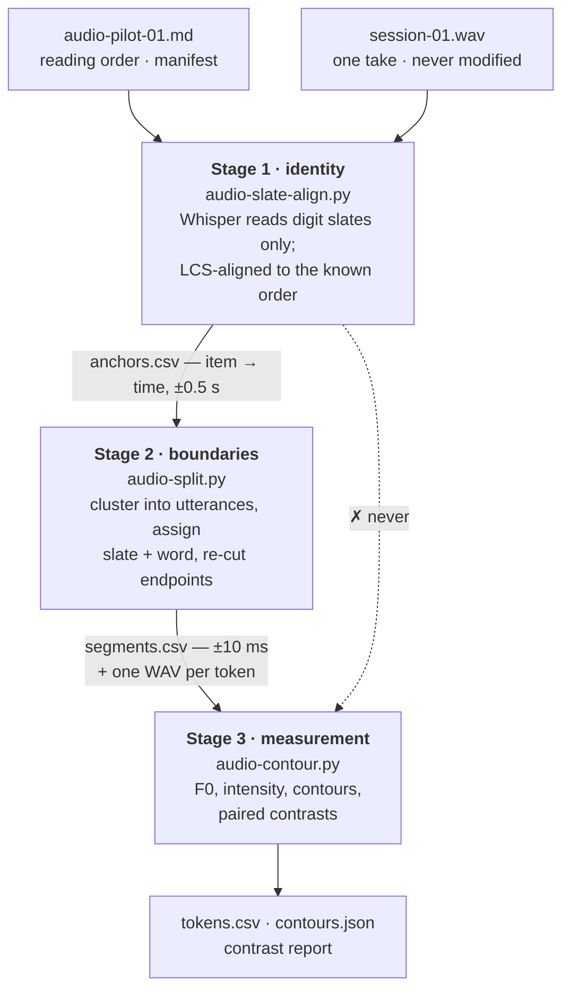

# Audio Pipeline — Session Log & Learnings

**Status:** [Active] — raw material for the eventual `audio-pipeline` skill (plan M10)
**Covers:** 2026-08-11 (pilot design) → 2026-08-12 (end-to-end pipeline, first results)
**Plan:** `planning/audio-pipeline-plan.md` · **Diagram:** `planning/audio-pipeline-map.html`

> This is a retrospective, not a roadmap. The plan holds current state and what's next;
> this holds *why the pipeline looks the way it does*, including the approaches that were
> tried and abandoned. When the workflow is folded into a skill, the procedure comes from
> the plan and the **judgement** comes from here.

---

## 1. The shape of the pipeline

The dotted edge is the design. Stage-1 times are good enough to say *item 17 is in here*
and useless for *V₁ was 12 ms longer*; letting them reach measurement would corrupt every
number while looking like it worked.

---

## 2. How the session actually went

**Set out to do:** a first-pass recording to gather data points, with the minimum number
of decisions up front. Two decisions were taken (V₁-contrast set of 25 items; 5
repetitions); everything else was deliberately deferred to whatever the recording showed.

**Ended up building:** the whole chain. Four tools, ~1,000 lines, 122 of 125 tokens
measured, and one substantive result — plus a published finding that had to be retracted.

### The order things happened, including the wrong turns

1. **Generated the manifest and teleprompter**, then Mat recorded 10m52s to the protocol.
2. **Characterised the session** (`audio-metrics.py`). Capture path good — floor −60 dBFS,
   no mains hum, SNR ~29 dB. Three defects: wrong format (44.1k/16-bit, not 48k/32-float),
   ~17 clipped utterances, 25 dB level spread.
3. **The protocol's core assumption failed.** Within-item and between-item pauses differed
   by 0.02 s. A parameter sweep ran 68→353 segments with no plateau.
4. **Recommended a fix — tighter pause discipline — and Mat rejected it**: *"when saying 25
   words 5 times it's really hard."* That single sentence killed the timing-based design.
   Correctly: a protocol that requires sustained metronomic behaviour from a human across
   125 utterances is not a protocol, it's a wish.
5. **Replaced timing anchors with content anchors.** Whisper on the digit slates. 91%
   recall, 100% recoverable via the known reading order.
6. **First contour pass, and a bad publish.** The word-finder was written inside the
   contour tool. It dropped 4 of 27 Frame A/B tokens and reported `óhò` at 1.00 s ± 0.30 —
   long for a disyllable. Published anyway, with caveats. Headline: *the declared minimal
   pair does not separate and is arguably reversed.*
7. **Built stage 2 properly** and the finding changed. Three iterations to get there
   (below). With correct boundaries the pair is not reversed — the earlier claim was a
   segmentation artefact.
8. **Rebuilt stage 3 on top of stage 2**, added block-pairing, and got the real result:
   pitch moves the predicted way but inconsistently; the one consistent effect in the set
   is **duration**, on the pair documented as a *pitch* contrast.

### The three failed word-finders, and what each taught

| Attempt | Why it failed | Lesson |
|---|---|---|
| take the last energy blob | Frame A is /h/-medial; the word fragments and this returns the final syllable | the language fragments words; any blob rule must expect that |
| everything after the largest gap | swallowed trailing material; durations ballooned to 1.0–2.1 s | an unbounded rule will happily eat the next utterance |
| grouped blobs, take group[1] | noise blobs at +13–24 dB polluted the grouping; intervals ran past the next slate | filter for *speech* before grouping; bound the interval |

The fix wasn't a fourth heuristic. It was **asking a different question** (§3.2).

---

## 3. What we learned

### 3.1 Test the protocol's assumption before trusting the protocol

The pause hierarchy was the load-bearing assumption of the original design and it was never
verified — the first recording was also the first test of it. Cheap insurance: a 30-second
throwaway recording would have falsified it before 125 utterances were committed to it.

**For the skill:** any new session protocol gets a smoke recording, and the analysis that
would validate its central assumption runs on the smoke recording first.

### 3.2 Ask the weakest question that still gets you the answer

Silence segmentation asked *where does each item begin* — a strong question, and the sweep
had no plateau: every parameter setting gave a different answer and the ones near the truth
were coincidences.

Utterance clustering asks only *where is a run of speech*. Same audio, same envelope, same
kind of threshold — but the group count moves only 303→327 across the entire parameter
grid. A real plateau.

The item boundaries then come from the anchors, not from the silence. Nothing about the
audio got easier; the question got weaker, and the weak question has a stable answer.

**The diagnostic is the sweep.** If a parameter sweep shows no plateau, the method is
wrong and no amount of tuning will fix it. Run the sweep before trusting any threshold.

### 3.3 Separate identity from boundaries

Different precisions, different tools, different failure modes:

- **Identity** tolerates gaps. A missed slate between two correct anchors is still
  unambiguous — the reading order fixes it. Failure is *local*.
- **Boundaries** tolerate nothing, but only have to be right *locally*, inside an interval
  whose contents are already known.

Timing-based structure fails globally: one missed boundary shifts every later label.
Content-based identity fails locally: a missed anchor costs exactly itself. That asymmetry
is the whole argument for the split.

### 3.4 Use the recogniser as an anchor finder, not a transcriber

Whisper has no acoustic model for Rickett Yack and hallucinates English at it — pilot 01
produced *"Thank you very much for joining us today"* over a quiet stretch and a 26-way
`Three.` repetition loop. None of it mattered:

1. English digits are the one thing in the recording it *can* hear.
2. The expected sequence is known in advance.
3. Monotonic LCS alignment means hallucinations drop out instead of propagating.

**Invariant:** slates stay English digits, permanently. Slating in the conlang collapses
the scheme — there would be nothing to anchor on.

### 3.5 Look at the data before tuning the parameters

Three heuristics were burned guessing at blob structure. What actually solved it was
dumping the real utterance sequence with the anchors interleaved and reading it — at which
point the rule was obvious in about a minute: **the anchor lands inside its digit**, and
the word follows 1.3–1.8 s later.

That rule could not have been guessed. It is also the opposite of what the tool's own
docstring assumed at the time (that the anchor preceded the word).

`audio-split.py --dump 5-60` exists because of this and is the first thing to run when a
segment looks wrong.

### 3.6 Calibrate against the bias you're trying to remove

Endpoints were originally cut at a fixed level above the *session* floor. With a 25 dB
spread across the corpus that makes loud tokens measure longer than quiet ones for reasons
that have nothing to do with phonology — and duration was one of the two measures under
test.

The fix is peak-relative endpointing, but the parameters can't be eyeballed. The bias
*is* the within-item correlation between a token's peak level and its measured duration,
so that correlation is the objective: swept over the grid it runs −0.31 at rel_db=20 and
−0.05 at the chosen defaults. Ten minutes of sweeping, and the number that mattered moved
by 6×.

**Generalisation:** when a measurement choice could bias the result, write down the
statistic that *is* the bias and minimise it. Don't argue about the parameter.

### 3.7 The language fights every silence-based rule

/ʔ/, geminates, /h/, /θ/, /sː/ put word-internal silences into `hóhonìt`, `ossıî`, `ŕeut`,
`béntsıìy` that are as long as the gaps between utterances. This bit **twice** — once
killing the splitter, once again in the endpoint refiner, where a naive outward walk halted
at the first internal closure and returned one syllable of a disyllable (durations
collapsed to 0.11–0.18 s and 22 tokens were rejected).

Any energy-based rule in this language needs an explicit bridge across internal closures.
Assume it will be needed; the failure looks like plausible-but-short tokens, not a crash.

### 3.8 One segmentation, one library

The retracted finding came from two tools each deciding their own word boundaries. Every
disagreement between two measurements was then potentially a segmentation artefact rather
than a fact about the recording — and the one that got published was exactly that.

`tools/audiolib.py` exists so boundaries are decided once, in stage 2, and everything
downstream cites them.

### 3.9 Demote, don't drop. Flag, don't guess.

Two rules that took 85% → 98% yield without loosening a single plausibility check:

- **Demote:** a row whose anchor doesn't resolve isn't a lost item — a bad anchor is a
  stage-1 mistake, and the reading order still fixes identity. Demote it to unanchored and
  recover it by the same path as a slate that was never heard.
- **Don't gate on the wrong thing:** an item was being rejected for having an odd-length
  *slate*, when nothing is measured on the slate. Warn; don't disqualify.

And where it's genuinely ambiguous (3 of 125), reject with a timestamp for a human to
listen to. A guessed boundary is indistinguishable from a real one downstream, which makes
it worse than a gap.

### 3.10 Don't publish an analysis before validating the segmentation under it

The tell was there: `óhò` measured 1.00 s ± 0.30 for a two-syllable citation form. That
was flagged in the caveats and published anyway. It should have been a blocker — a
duration that implausible means the boundaries are wrong, and every number resting on them
is unsafe regardless of how carefully the caveats are worded.

**Rule: run the plausibility check on the segmentation first, and treat a failure as a
blocker rather than a caveat.** Durations against expected syllable count is the cheap one
and would have caught it.

### 3.11 Spend the experimental design in the analysis

The items were read in five blocks with rotated order specifically so fatigue and
list-final lowering would hit both members of a pair equally. The first analysis pooled all
reps and threw that away.

Pairing within block is nearly free and changes the reading completely: Frame A's effect
size (d = 1.13) looks decisive pooled, but only 4 of 5 blocks agree. With n=5, all five
agreeing is the weakest result that means anything (sign test p = 0.06).

Also: **report the F0 centroid, not the argmax.** On a nearly flat contour argmax latches
onto noise, so 2% and 98% peaks describe the same shape. The centroid degrades gracefully
to 50%.

### 3.12 A tracker with a floor set too high doesn't fail, it lies quietly

`F0_MIN` was 70 Hz against a speaker median of 84.5 Hz — four semitones of headroom, which
creak at the end of a citation word falls straight through. The tracker did not drop those
frames or mark them unvoiced. It returned the octave above: *noê* block 2 read 103.7 Hz
where the true value is 82.0. That is a plausible-looking number in a plausible-looking
range, sitting in a CSV, contributing to a published contrast.

The tell was in the data the whole time and was never looked at: **`f0_min` sitting exactly
on the search floor**, in 27 of 120 tokens. A parameter that a fifth of your data is pinned
against is a parameter that is doing the measuring.

**Rules.** Set the floor from the measured speaker median, not from a textbook range, and
leave an octave of room under it. Then check two rail statistics before trusting any F0
summary: how many tokens sit on the floor (should be ~0), and the **voiced fraction** — a
median of 0.47, with 19 of 120 tokens under 0.30, means half the frames of a typical token
contributed nothing and the per-token summaries are weaker than they look. The fix was
cheap and the diagnostic that lowering the floor is not merely admitting noise is that
voiced fraction barely moved (0.40 → 0.41) while railing went to zero.

Corollary for reading these results: the duration finding needs no pitch tracking at all,
which is a large part of why it is the sturdiest number in the set.

### 3.13 A wrong prediction is worth more than a right one here

The pair *nóè* / *noê* is documented as a pitch contrast. The pipeline found no pitch
difference — both contours flat at the bottom of the range, no V₁ peak in either, against
Frame A items that decline 9–16 Hz from a real accent — and a large, perfectly consistent
duration difference instead.

The author's response was not to defend the entry but to locate the error upstream of it:
both words descend from GA phrases accented on the **second** element (*in a WAY*, *no,
WAY!*), so *no* is unstressed in both, and the entry's "residual high pitch on *no*" was
derived from a **NO** way! reading that is possible but rare. The production was faithful to
GA; the prescription was not.

This is the one direction in which a single-speaker corpus of the designer's own production
is genuinely evidential (§4). It cannot confirm that the residue analysis is right. It can
show that a specific documented contrast **is not being produced**, and send you back to the
GA premise it was derived from — a claim decidable without the corpus at all.

**And test the rescue hypothesis, don't accept it.** The first explanation offered for the
280 ms was the comma pause in *no, WAY!* — coherent, and false. Internal sub-threshold time
is 44 ms in *both* words, identically; removing all of it leaves 252 of the 280 ms. The
independent check is better still: the endpointer bridges dips only to 150 ms, so a real
200–300 ms pause would have halted the walk and left a second sounding chunk outside the
boundary — and in all five blocks the token is one unbroken run. Ten minutes of work, and it
turned a plausible story into a measured no. The lengthening is sounding material, and the
emphatic-vs-hedging confound is still standing.

### 3.14 Environment notes (Windows)

- Interpreter is `C:\Users\schin\anaconda3\python.exe`. System `python`/`python3` are
  broken Store stubs.
- **Reconfigure stdout to UTF-8 in every tool.** Headwords carry diacritics the console
  codepage can't encode, and the report crashes partway through on a legal item name.
- Present: numpy, scipy, torch, transformers. Absent: ffmpeg, SoX, librosa, soundfile,
  parselmouth. The F0 tracker is hand-rolled to avoid the parselmouth dependency and is
  adequate for whole-word contour comparison.

---

## 4. What the results are worth

One speaker, who designed the language, producing citation forms. This can show whether his
production matches the spec; it cannot confirm the pitch-accent residue analysis. A
negative result is informative; a positive one is not evidence for the analysis.

With n=5 the pipeline detects large effects and nothing else. It will never resolve
"V₁ is 8% longer."

**The standing rule: no reconciliation output gets written into `phonology.md` or
`dictionary.md` as confirmation.** The *nóè* / *noê* duration result is the live test of
that rule — it is the most interesting thing the session produced, it has a live confound
(emphatic interjection vs. hedging adverb), and it stays out of the canon docs until a
frame-controlled recording addresses the confound.

The rule has an edge the first pass didn't draw, and §3.13 found it. What the corpus cannot
do is confirm an analysis. What it **can** do is show that a documented contrast is absent
from production — and when the author then traces that absence to a mistaken premise about
GA, the resulting correction is licensed by the GA claim, not by the recording. The
recording only pointed at where to look. So: *nóè*'s "residual high pitch on *no*" is
reviewable canon (§9 of the plan); its 280 ms of extra length is not.

---

## 5. Toward the skill (plan M10)

What a formalised `audio-pipeline` skill would own, in the order it would run:

1. **Design the item list** — segmentally matched pairs so whole-word comparison needs no
   forced aligner; blocked reading order with rotation; explicit note of which prediction
   each frame tests and which are untestable without an aligner.
2. **Generate the sheet** (manifest + teleprompter + session header), never hand-write it.
3. **Smoke-test the protocol's central assumption** before recording the real session.
4. **Record** to the frozen setup, logging it *before* recording.
5. **Characterise** — capture defects (format, clipping, level spread, hum) before anything
   else, since some of them silently disqualify measures downstream.
6. **Stage 1 → 2 → 3**, with `--dump` as the standard debugging entry point.
7. **Validate the segmentation** against expected syllable counts. Blocker, not caveat.
8. **Analyse paired within block**, report effect size *and* same-sign block count, and
   name the confounds.
9. **Never write results into the canon docs.**

Open before that: session 02 (M8), the noise-reduction question, connected-speech protocol,
and MFA viability.
